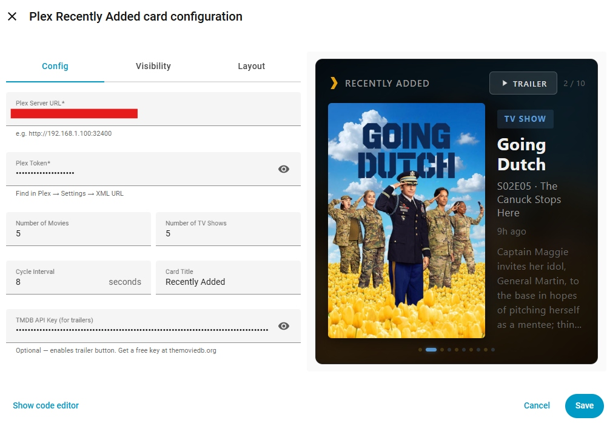

# Plex Recently Added Card

A custom Home Assistant Lovelace card that shows your recently added movies and TV shows from Plex. Auto-cycles through items with poster art, blurred background, synopsis, ratings, and color-coded indicators.

[](https://github.com/hacs/integration)


<p align="center">
  
</p>

## Features

- Displays the 5 most recently added movies and 5 most recently added TV shows
- Interleaved cycling — alternates between movies and TV shows
- Poster art with blurred background transitions
- Synopsis, ratings, genre, and "time ago" for each item
- Color-coded dots — gold for movies, blue for TV shows
- Connects directly to your Plex server (no additional integrations required)
- Deduplicates TV shows — only shows the most recent entry per series
- **Visual editor** — configure the card through a graphical UI, no YAML required
- **Trailers** — tap the trailer button on movies and TV shows to watch YouTube trailers (requires a free TMDB API key)

---

## Install via HACS (Recommended)

1. Open **HACS** in Home Assistant
2. Click the three dots (top right) → **Custom repositories**
3. Enter `https://github.com/rusty4444/plex-recently-added-card` and select **Dashboard** as the category
4. Click **Add**
5. Search for "Plex Recently Added Card" in HACS and click **Install**
6. Restart Home Assistant

The Lovelace resource will be registered automatically.

## Install Manually

1. Download `plex-recently-added-card.js` from the [latest release](https://github.com/rusty4444/plex-recently-added-card/releases/latest)
2. Place it in your `<config>/www/` directory
3. Go to **Settings → Dashboards** → three dots (top right) → **Resources**
4. Click **Add Resource**
5. URL: `/local/plex-recently-added-card.js`
6. Type: **JavaScript Module**

---

## Visual Editor

The card includes a built-in visual editor. When you add or edit the card, you'll see a graphical form instead of raw YAML.

<p align="center">
  
</p>

You can still use YAML if you prefer — click "Show code editor" at the bottom of the editor.

---

## Configuration

Add a **Manual card** to your dashboard with this YAML:

```yaml
type: custom:plex-recently-added-card
plex_url: http://YOUR_PLEX_IP:32400
plex_token: YOUR_PLEX_TOKEN
movies_count: 5
shows_count: 5
cycle_interval: 8
title: Recently Added
tmdb_api_key: YOUR_TMDB_READ_ACCESS_TOKEN  # Optional: enables trailer button for movies
```

For best results, set the card to span the full width of a section and give it plenty of vertical space (e.g., 8+ grid rows).

### Options

| Option | Type | Default | Description |
|--------|------|---------|-------------|
| `plex_url` | string | **Required** | Your Plex server URL (e.g., `http://192.168.1.100:32400`) |
| `plex_token` | string | **Required** | Your Plex authentication token |
| `movies_count` | number | `5` | Number of recently added movies to display |
| `shows_count` | number | `5` | Number of recently added TV shows to display |
| `cycle_interval` | number | `8` | Seconds between cycling to the next item |
| `title` | string | `"Recently Added"` | Header text (set to empty string to hide) |
| `tmdb_api_key` | string | Empty (trailers disabled) | TMDB Read Access Token — enables the trailer button on movies |
| `fill_height` | boolean | `true` | When enabled, card stretches to fill its container. Disable if the card appears collapsed |
| `card_height` | number | `300` | Card height in pixels (only used when `fill_height` is `false`) |

### Finding your Plex token

1. Sign in to the Plex Web App
2. Browse to any media item
3. Click **Get Info** → **View XML**
4. The token is in the URL as `X-Plex-Token=XXXXX`

---

## How It Works

- Connects directly to your Plex server's API (no HA Plex integration needed for this card)
- Discovers all movie and TV libraries automatically
- Fetches recently added items from each library
- Deduplicates TV shows so you only see one entry per series (the most recent)
- Interleaves movies and shows for variety (movie, show, movie, show...)
- Pre-loads poster and background art for smooth transitions

---

## Trailers

Tap the **Trailer** button on any movie or TV show to watch its YouTube trailer. This feature requires a free TMDB (The Movie Database) API key.

For **movies**, the card looks up the movie trailer directly from TMDB.

For **TV shows**, the card tries to find the best available trailer in this order:
1. Season-specific trailer (e.g., the Season 2 trailer)
2. Series trailer (the main show trailer)
3. If no trailer is found on TMDB, the button is hidden for that item

The card fetches the TMDB ID from Plex's movie metadata (the `Guid` array), then uses it to look up trailers via the TMDB API.

### How to get a TMDB Read Access Token

1. Create a free account at [themoviedb.org](https://www.themoviedb.org/signup)
2. Go to [Settings → API](https://www.themoviedb.org/settings/api)
3. Request an API key (select "Developer" and fill in basic info — any values work for personal use)
4. Once approved, copy the **Read Access Token** (the long string starting with `eyJ...`) — not the shorter API Key
5. Add it to your card config as `tmdb_api_key`

The card uses TMDB to look up movie trailers by matching the media's TMDB ID. Trailer results are cached so each movie is only looked up once.

---

## Troubleshooting

- **Card not appearing after install**: Clear your browser cache, or append `?v=2` to the resource URL in Settings → Dashboards → Resources
- **No items showing**: Double-check your `plex_url` and `plex_token` — the card connects directly to Plex, not through HA. Make sure the Plex URL is reachable from the device viewing the dashboard.
- **CORS errors in browser console**: If your Plex server is on a different host, you may need to allow CORS in Plex settings or access the dashboard via the same network.
- **Card blank when HA is served over HTTPS**: If you access HA via HTTPS (Nabu Casa, nginx reverse proxy, etc.), your browser will block HTTP requests to Plex (mixed content). Use Plex's built-in HTTPS URL instead — Plex provides valid certificates via `.plex.direct` domains. To find yours:
  1. Go to `https://plex.tv/api/resources?X-Plex-Token=YOUR_TOKEN`
  2. Find your server's `.plex.direct` URL in the connections list (e.g., `https://192-168-1-100.xxxxxxxxxx.plex.direct:32400`)
  3. Use that as your `plex_url` in the card config

---

## Related

Looking for a cinema-style "Now Showing" display for when Plex is actively playing? Check out [plex-now-showing](https://github.com/rusty4444/plex-now-showing).

Using Kodi instead of Plex? Check out [kodi-recently-added-card](https://github.com/rusty4444/kodi-recently-added-card) and [kodi-now-showing](https://github.com/rusty4444/kodi-now-showing).

Using Jellyfin? Check out [jellyfin-recently-added-card](https://github.com/rusty4444/jellyfin-recently-added-card) and [jellyfin-now-showing](https://github.com/rusty4444/jellyfin-now-showing).

Using Emby? Check out [emby-now-showing](https://github.com/rusty4444/emby-now-showing) and [emby-recently-added-card](https://github.com/rusty4444/emby-recently-added-card).

---

## Credits

Built by Sam Russell — AI used in development.

YouTube trailer embedding approach adapted from [ha-youtubevideocard](https://github.com/loryanstrant/ha-youtubevideocard) by [loryanstrant](https://github.com/loryanstrant).
